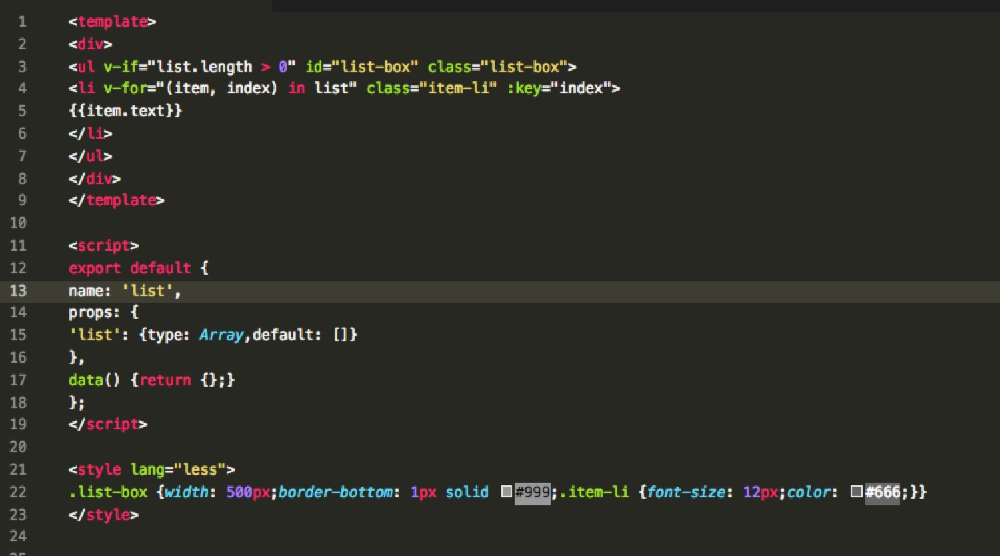
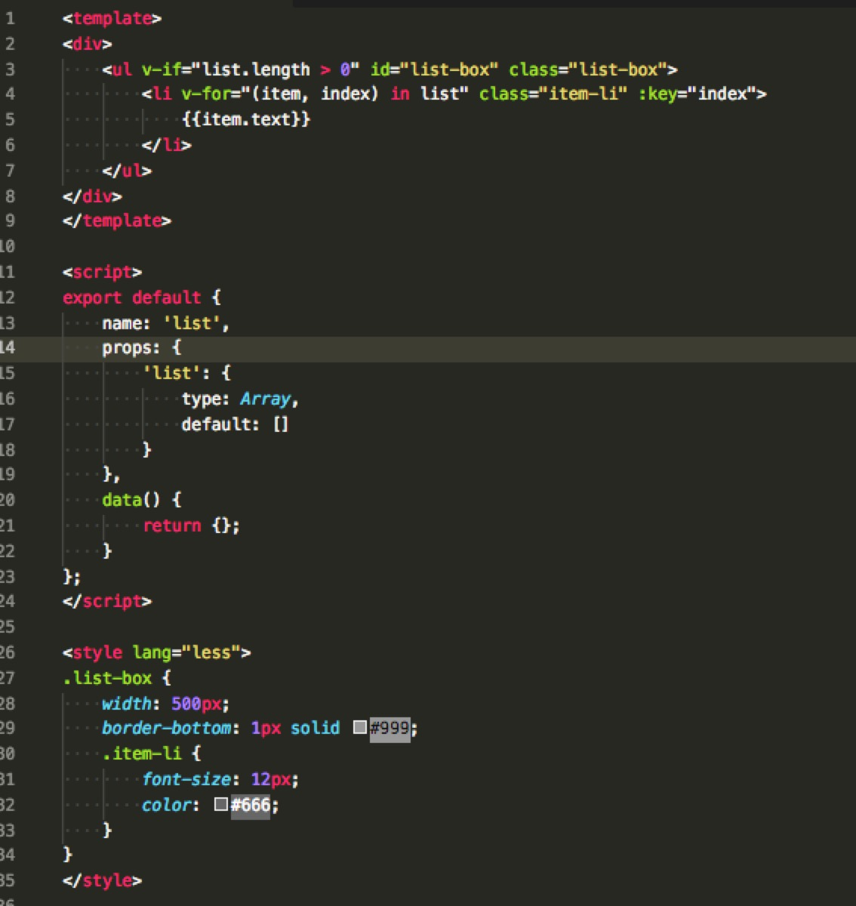

# vue-format README

format single file with '.vue'.（格式化单组件“.vue”文件代码）

## Features
Before:(格式化前)

After:(格式化后)

Command:(命令)

## Requirements
- js-beautify: [https://github.com/beautify-web/js-beautify](https://github.com/beautify-web/js-beautify)

## Extension Settings
no yet

## Release Notes
Init

### 0.0.1
- Init
